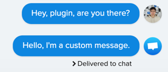

# Crisp plugin Go example

This simple plugin shows you how to create a plugin using Crisp API library for Golang.

## Setup for a plugin

1. Create an account on the [Crisp Marketplace].
2. Create a plugin on the marketplace. (Add it to `main.go: pluginURN`)
3. In the marketplace go to the **API tab of your plugin** and add your Identifier & Key in the appropriate fields (`main.go: crispAPIIdentifier, crispAPIPassword`).
4. Now switch to the **Settings tab of your plugin** and:
   * Add your plugin config HTTPS url. To achieve that you can use https://ngrok.com/, it will help you bind a public HTTPS address to your local server. 
      * Example - Settings URL: `https://a1e9e89c2d80.ngrok.io/config`
   * Add you plugin custom settings schema. For this example you can use the config file available at `schema.json`. (Please change the URN to match yours.)
5. Go in **Settings (from the left pane)** and add a Trusted Website. This will help you test your plugin in your Crisp Website before publishing it. You can find the documentation on how to find the website ID of your Crisp chat here: https://help.crisp.chat/en/article/how-to-find-the-website-id-1ylqx1s/

From there you can start building your own plugin! You can use the API reference for help: https://docs.crisp.chat/api/v1/.
If you want to have a first glance of a plugin, you can start the ping-pong plugin by following the next instructions.

## Start the plugin example

This plugin will send a custom message whenever an operator/agent sends a message. The message content is based on the config that you have choose.

1. In the project root, run: `go get && go build && ./crisp-plugin-ping`
2. You should now see in your terminal: `Socket is connected: now listening for events`. You are ready to Go!
3. Configure the custom message: Go in [Crisp Marketplace] > your plugin > Settings > Send test request. A popup will appear showing what your users will see when configuring their plugin instance. Choose your message and click "Save".
3. In your Crisp chat website, create a new fake conversation, with yourself for example.
4. Send a message. 

Response example: 

[Crisp Marketplace]: https://marketplace.crisp.chat/